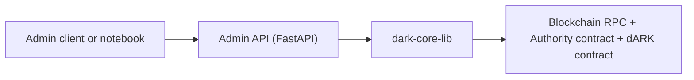
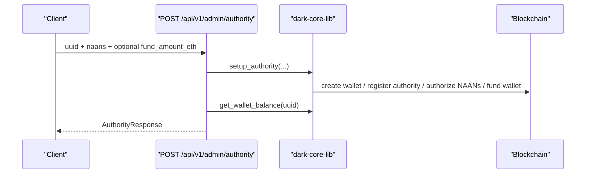
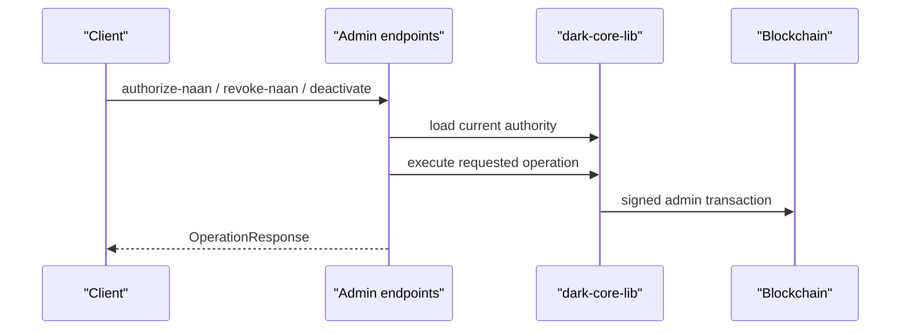
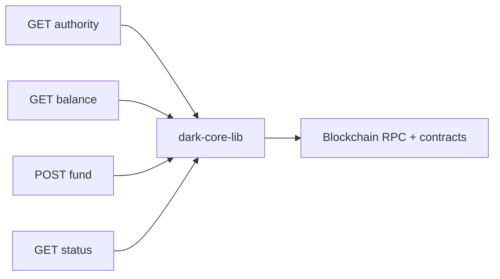
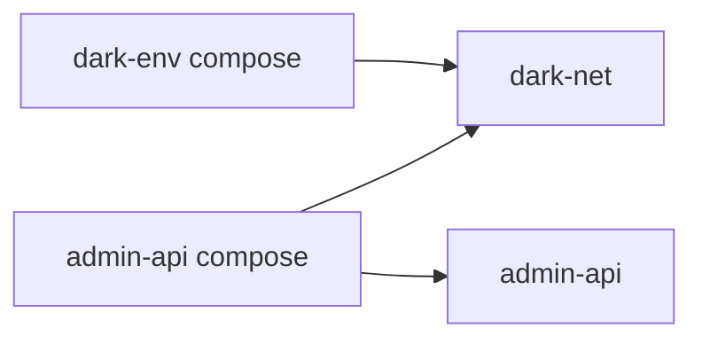

# dARK Core Admin API

Administrative REST API for authority onboarding and authority management in the dARK network, powered by `dark-core-lib`.

## Overview

`dark-core-admin-api` is the service used to operate the authority layer of the dARK stack from an admin node. Unlike the minter, it does not keep a local lifecycle database or background worker. It is a thin HTTP layer over `dark-core-lib` for privileged operations such as:

- registering new authorities
- authorizing and revoking NAANs
- deactivating authorities
- funding authority wallets
- checking balances and admin status

This service is intended for controlled administrative environments, not for public exposure.

## Documentation Map

Use the docs in this order:

- [README.md](./README.md)
  - operational overview, endpoints, deployment, config
- [admin-architecture.md](./admin-architecture.md)
  - technical implementation details, module map, request flows
- [notebooks/README.md](./notebooks/README.md)
  - notebook usage and environment variables

## Runtime Architecture

If you want the implementation-oriented view behind this diagram, continue with [admin-architecture.md](./admin-architecture.md).



## Main Responsibilities

- Admin API
  - exposes administrative HTTP endpoints
  - validates request payloads
  - enforces the current mTLS gate
  - translates `dark-core-lib` exceptions to HTTP responses
- `dark-core-lib`
  - owns the blockchain client
  - signs transactions with the admin key
  - implements authority management operations
- Blockchain
  - stores the final source of truth for authorities, NAAN authorization, and authority activity

## Main Flows

### 1. Register Authority

Registering an authority is the highest-level operation in the service.



What this does conceptually:

- creates the authority wallet material
- registers the authority on-chain
- authorizes the requested NAANs
- optionally funds the wallet using the admin account

### 2. Manage Authority Permissions

These operations mutate the on-chain authority state directly.



Current mutation endpoints:

- `POST /api/v1/admin/authority/{uuid}/authorize-naan`
- `POST /api/v1/admin/authority/{uuid}/revoke-naan`
- `POST /api/v1/admin/authority/{uuid}/deactivate`

### 3. Wallet and Status Operations

Read and funding flows are simpler, but still depend on the configured admin signer and blockchain client.



## API Surface

| Method | Endpoint | Purpose |
|--------|----------|---------|
| `GET` | `/health` | Health and blockchain/admin connectivity |
| `GET` | `/api/v1/admin/status` | Admin address, balance, block, chain id |
| `POST` | `/api/v1/admin/authority` | Register new authority |
| `GET` | `/api/v1/admin/authority/{uuid}` | Get authority info |
| `POST` | `/api/v1/admin/authority/{uuid}/authorize-naan` | Authorize NAAN |
| `POST` | `/api/v1/admin/authority/{uuid}/revoke-naan` | Revoke NAAN |
| `POST` | `/api/v1/admin/authority/{uuid}/deactivate` | Deactivate authority |
| `GET` | `/api/v1/admin/authority/{uuid}/balance` | Get authority wallet balance |
| `POST` | `/api/v1/admin/authority/{uuid}/fund` | Fund authority wallet |

## Security Model

### Current Behavior

- every admin route is protected with `require_mtls`
- when `MTLS_ENABLED=false`, the middleware allows requests through for local development
- when `MTLS_ENABLED=true`, the request must present a valid client certificate path as understood by the deployment

### Important Operational Note

This API performs privileged admin operations and should be treated as highly sensitive. In production it should:

- run with mTLS enabled
- be reachable only from trusted operator networks
- use a protected admin private key source
- avoid direct public internet exposure

## Quick Start

### Inside `dark-developer`

```bash
cd /Users/lmatas/source/dark-developer
source venv/bin/activate
pip install -r components/services/dark-core-admin-api/requirements.txt
pip install -e components/libraries/dark-core-lib
pip install -e components/services/dark-core-admin-api
```

### Standalone Local Development

```bash
python3 -m venv .venv
source .venv/bin/activate
pip install -r requirements.txt
pip install -e ../dark-core-lib
```

### Run Manually

```bash
uvicorn app.main:app --host 0.0.0.0 --port 8000 --reload
```

## Docker Deployment in the Monorepo

The service is designed to run as its own compose project and attach to the blockchain network created by `dark-env`.



### Start Order

```bash
cd /Users/lmatas/source/dark-developer/components/blockchain/dark-env
docker compose up -d

cd /Users/lmatas/source/dark-developer/components/services/dark-core-admin-api
docker compose up -d --build
```

### Docker Notes

- the compose stack joins the external `dark-net` network
- `DARK_RPC_URL` comes from `.env.integration` as generated by dark-deployer: `http://rpc01:8545` when blockchain runs on this same `dark-net` (co-located install), or the real external RPC address for a decoupled/remote blockchain tier
- the container reads `.env.integration`
- the image installs `dark-core-lib` from the sibling `components/libraries/dark-core-lib`

## Configuration

The service reads environment configuration from `.env` and `.env.integration`.

### API Runtime

| Variable | Description | Default |
|----------|-------------|---------|
| `ADMIN_API_HOST` | API bind host | `0.0.0.0` |
| `ADMIN_API_PORT` | API bind port | `8000` |
| `DEFAULT_FUND_AMOUNT_ETH` | Default funding amount for new authorities | `0.01` |

### Blockchain

| Variable | Description |
|----------|-------------|
| `DARK_RPC_URL` | RPC endpoint |
| `DARK_CHAIN_ID` | Chain id |
| `DARK_AUTHORITY_ADDRESS` | Authority contract address |
| `DARK_CONTRACT_ADDRESS` | dARK contract address |
| `DARK_ADMIN_PRIVATE_KEY` | Admin signer private key |

These values are required for a functional deployment.

### TLS and mTLS

| Variable | Description | Default |
|----------|-------------|---------|
| `MTLS_ENABLED` | Enable mTLS gate | `false` |
| `TLS_CERT_FILE` | Server certificate path | - |
| `TLS_KEY_FILE` | Server private key path | - |
| `TLS_CA_FILE` | CA certificate path | - |

## Useful URLs

Once the service is running:

- Swagger UI: `http://localhost:8000/docs`
- ReDoc: `http://localhost:8000/redoc`
- Health: `http://localhost:8000/health`
- Admin status: `http://localhost:8000/api/v1/admin/status`

## Notebook

The service includes one HTTP-level integration notebook:

- [notebooks/admin_api_test.ipynb](./notebooks/admin_api_test.ipynb)

See [notebooks/README.md](./notebooks/README.md) for usage notes.

## Troubleshooting

### API fails on startup

Check:

1. blockchain RPC is reachable
2. contract addresses are configured
3. `DARK_ADMIN_PRIVATE_KEY` is set
4. if mTLS is enabled, all TLS file paths exist

### Health is unhealthy

Check:

1. `DARKCoreClient` initialized correctly
2. blockchain node is reachable
3. the admin account still has spendable balance

### Admin operation returns blockchain or authority error

Check:

1. the authority exists on-chain
2. the NAAN is in the expected current state
3. the admin account has permission to perform the operation
4. the admin account has enough balance for gas and funding

## Related Docs

- [admin-architecture.md](./admin-architecture.md)
- [notebooks/README.md](./notebooks/README.md)
