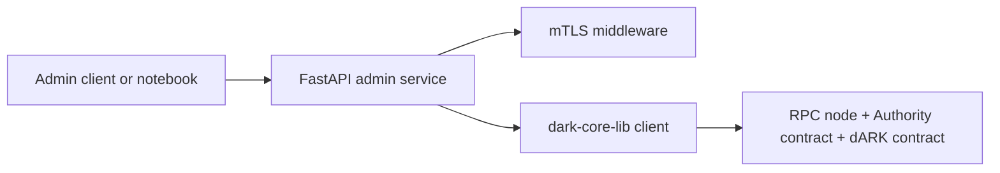
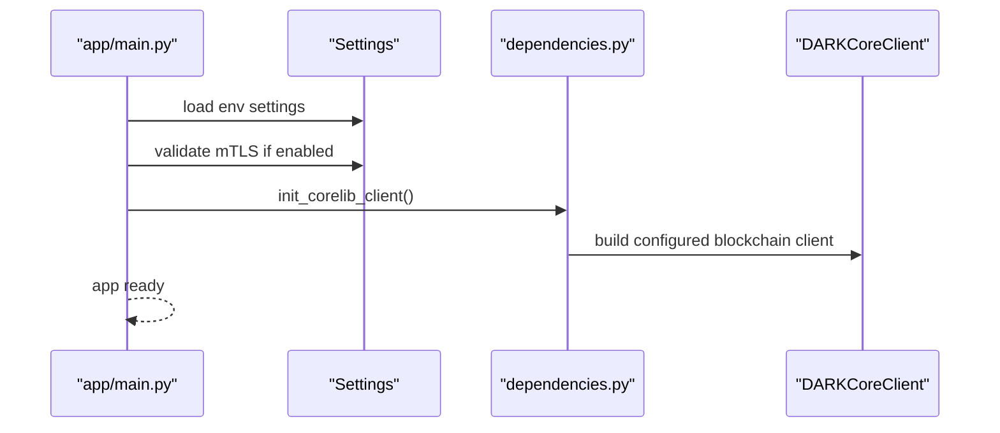
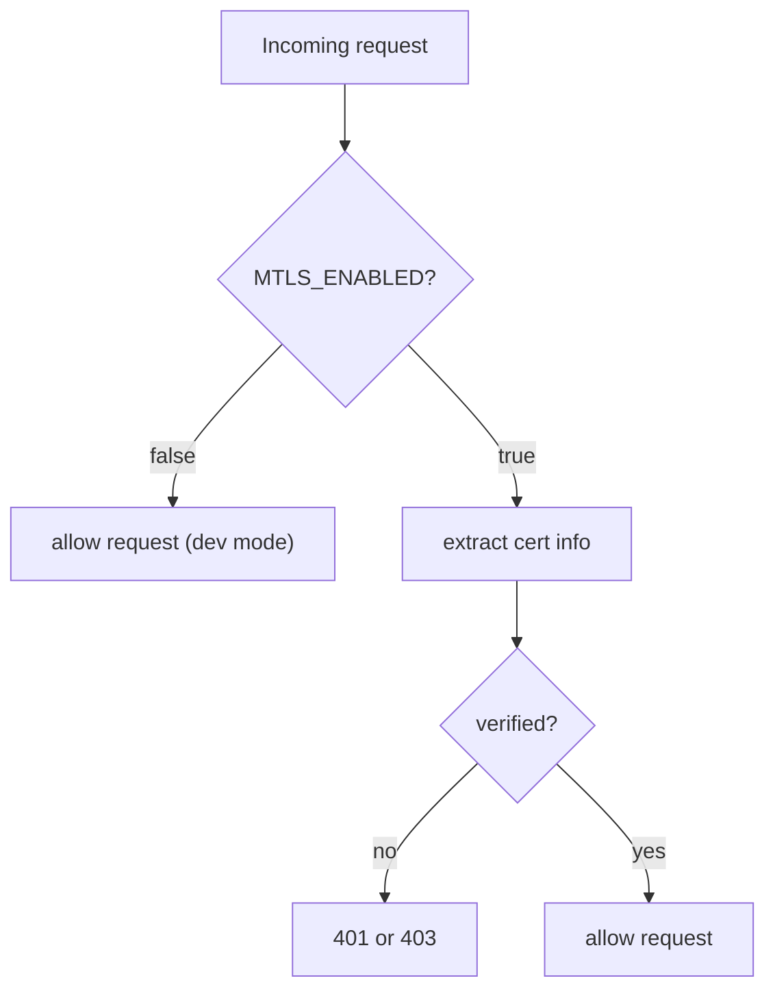
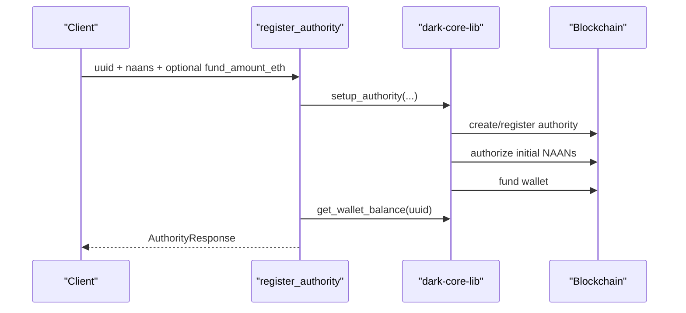
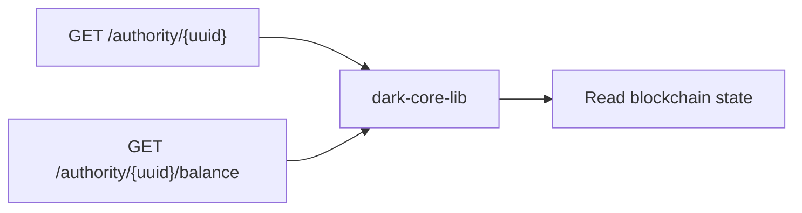
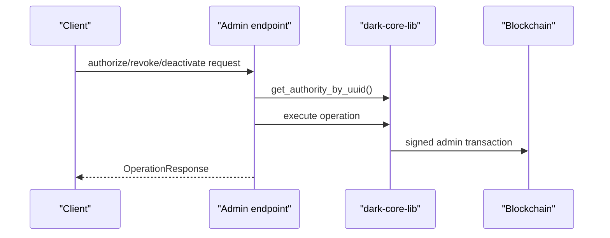
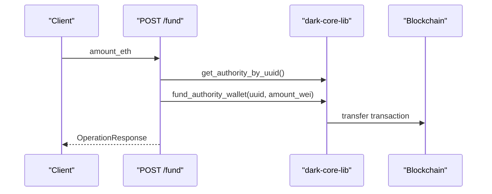
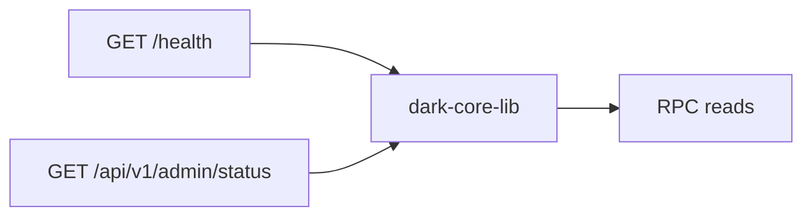
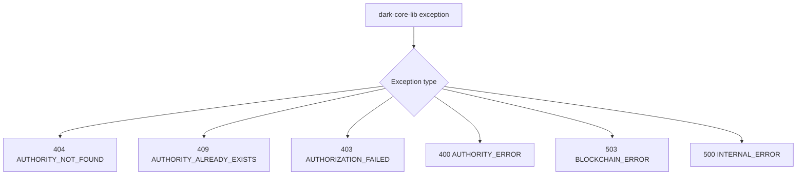
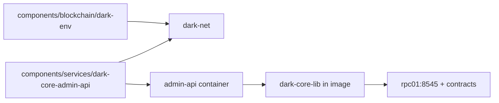

# dARK Core Admin API Architecture

This document complements the main [README](./README.md). The README explains how to run and operate the admin API; this document focuses on how the service is structured internally and how each request reaches the blockchain.

Language note: this document is intentionally maintained in English.

## 1. Design Goals

The admin API is intentionally simpler than the minter. Its main design choices are:

- no local business database
- no background worker
- thin HTTP layer over `dark-core-lib`
- blockchain as the source of truth
- privileged operations concentrated in one service

This keeps the admin surface small and makes the service easier to reason about operationally.

## 2. Module Map

- HTTP API
  - [`app/main.py`](./app/main.py)
  - [`app/api/router.py`](./app/api/router.py)
  - [`app/api/admin.py`](./app/api/admin.py)
- Runtime dependencies
  - [`app/config.py`](./app/config.py)
  - [`app/dependencies.py`](./app/dependencies.py)
  - [`app/middleware/auth.py`](./app/middleware/auth.py)
- Request and response models
  - [`app/models/requests.py`](./app/models/requests.py)
  - [`app/models/responses.py`](./app/models/responses.py)
- Error mapping
  - [`app/exceptions/handlers.py`](./app/exceptions/handlers.py)

## 3. Runtime Topology

There is no local persistence layer in this service. All business state is read from or written to the blockchain through `dark-core-lib`.

## 4. Startup and Dependency Wiring

The service startup in [`app/main.py`](./app/main.py) is straightforward:

1. load settings
2. validate mTLS config when enabled
3. initialize `DARKCoreClient`
4. expose routes and exception handlers

The client singleton is created in [`app/dependencies.py`](./app/dependencies.py).

## 5. Security Gate

All admin endpoints depend on `require_mtls` from [`app/middleware/auth.py`](./app/middleware/auth.py).

### Current Model

- when `MTLS_ENABLED=false`
  - the middleware allows requests through
  - this is the local development mode
- when `MTLS_ENABLED=true`
  - the middleware expects a verified client certificate path
  - certificate details can come from request headers or direct transport SSL state

## 6. Request Flows

### Register Authority

This is the richest workflow because it composes several admin actions into one high-level operation.

The admin API does not orchestrate these steps manually itself. It delegates the business operation to `dark-core-lib`, which owns the actual blockchain interactions.

An authority may also be registered with an empty `naans` list and receive NAANs later through `authorize-naan`. That pattern is useful for staged onboarding and for notebooks that demonstrate authority creation before ARK reservation.

### Query Authority and Balance

These endpoints are read-only from the API point of view, but they still rely on a correctly configured blockchain client.

### Authorize, Revoke, Deactivate

The endpoint logic is intentionally small:

- load current authority state
- short-circuit no-op cases when possible
- execute the requested `dark-core-lib` method
- return a normalized operation response

### Fund Wallet

### Status and Health

- `/health` is a lightweight service-level check
- `/api/v1/admin/status` is the richer operator-oriented status endpoint

## 7. Exception Mapping

The service maps `dark-core-lib` exceptions to HTTP responses in [`app/exceptions/handlers.py`](./app/exceptions/handlers.py).

This keeps the API layer small and lets `dark-core-lib` stay the source of domain-specific errors.

## 8. Configuration Model

The service configuration is defined in [`app/config.py`](./app/config.py).

### Core Settings

- API host and port
- mTLS settings
- blockchain RPC and contract addresses
- admin private key
- default funding amount

There is no database config because the admin API does not manage a local business store.

## 9. Deployment Topology

### Monorepo Docker Deployment

Important assumptions:

- blockchain is already running on `dark-net`
- `.env.integration` contains valid contract addresses and admin key
- `DARK_RPC_URL` in `.env.integration` is `http://rpc01:8545` for a co-located blockchain, or the real remote RPC address for a decoupled install — dark-deployer decides which at generation time, the compose file no longer hardcodes it

## 10. Tradeoffs and Current Limits

Some tradeoffs are intentional:

- there is no local queue or retry system in this service
- a failed blockchain operation fails the request directly
- there is no local audit database in the admin API itself
- the service assumes a trusted deployment boundary when mTLS is enabled

These are acceptable tradeoffs for an administrative control plane, but they are important to remember operationally.

## 11. Reading Order

If you are onboarding to this codebase, this order works well:

1. [README.md](./README.md)
2. [`app/main.py`](./app/main.py)
3. [`app/api/admin.py`](./app/api/admin.py)
4. [`app/dependencies.py`](./app/dependencies.py)
5. [`app/middleware/auth.py`](./app/middleware/auth.py)
6. [`app/exceptions/handlers.py`](./app/exceptions/handlers.py)
